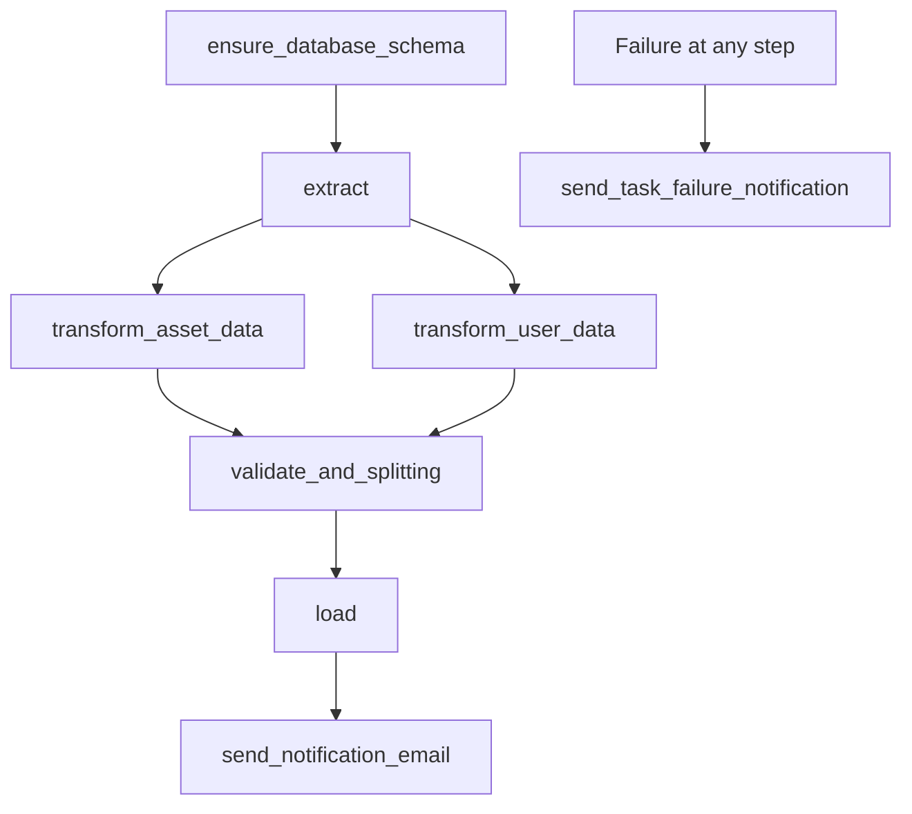

# ETL Pipeline Project

A robust and scalable ETL (Extract, Transform, Load) pipeline built with Apache Airflow for automated data processing of asset and user data from Google Sheets, with intelligent data transformation, validation, and multi-destination loading to Supabase and Google Drive.

## 🏗️ Architecture Overview

This enterprise-grade ETL pipeline leverages modern data engineering tools and practices:

- **Orchestration**: Apache Airflow 3.0.0 with CeleryExecutor
- **Database**: PostgreSQL 13 (Primary storage and Airflow metadata)
- **Cache/Message Broker**: Redis 7.2-bookworm (Celery backend)
- **Language**: Python 3.11.9 with type hints and modern features
- **Containerization**: Docker & Docker Compose (Production-ready setup)
- **Admin Interface**: pgAdmin4 for database management
- **Data Sources**: Google Sheets API integration
- **Destinations**: Supabase (real-time database) + Google Drive (backup storage)
- **Monitoring**: Flower for Celery task monitoring

## 📋 Complete Project Structure

```
ETL/
├── config/                    # Configuration files
│   ├── airflow.cfg           # Airflow configuration
│   └── schema.sql            # Database schema definitions
├── dags/                      # Airflow DAG definitions
│   ├── __init__.py
│   └── dag.py                # Main ETL pipeline DAG (iconnet_data_pipeline)
├── main/                      # Core ETL functionality
│   ├── __init__.py
│   ├── config.py             # Application configuration constants
│   ├── email_service.py      # Email notification system with HTML templates
│   ├── extract.py            # Data extraction from Google Sheets
│   ├── load.py               # Data loading to Supabase and Google Drive
│   ├── main_pipeline.py      # Integrated ETL pipeline orchestrator
│   ├── tasks.py              # Airflow task callables
│   ├── transform_asset.py    # Asset data transformation
│   ├── transform_user.py     # User data transformation
│   ├── validate.py           # Data validation and splitting
│   └── utils/                # Utility modules
│       ├── cleansing_asset.py   # Asset data cleansing pipeline
│       ├── cleansing_user.py    # User data cleansing pipeline
│       ├── common.py            # Common utility functions
│       ├── config_database.py   # Database configuration utilities
│       ├── coordinate_cleaner.py # Geographic coordinate processing
│       └── create_database.py   # Database schema management
├── logs/                      # Airflow logs (auto-generated by scheduler)
├── plugins/                   # Custom Airflow plugins
├── reports/                   # Generated reports and analytics
├── sql/                       # SQL scripts and queries
├── temp/                      # Temporary processing files (parquet storage)
├── docker-compose.yaml        # Docker services configuration
├── Dockerfile                 # Custom Airflow image with dependencies
├── google_credentials.json    # Google Sheets API credentials
├── pyproject.toml            # Poetry project configuration with dependencies
├── requirements.txt          # Python dependencies (Poetry export)
├── .env                      # Environment variables (not in repo)
└── README.md                 # This comprehensive documentation
```

## 🚀 Enhanced Features

### Core ETL Pipeline

- ✅ **Automated ETL Pipeline**: Scheduled daily processing at 2 AM with comprehensive error handling
- ✅ **Google Sheets Integration**: Real-time data extraction with authentication and retry logic
- ✅ **Dual Data Processing**: Parallel asset and user data transformation pipelines
- ✅ **Advanced Data Validation**: Multi-stage validation with data splitting and quality checks
- ✅ **Multi-destination Loading**: Intelligent loading to Supabase (primary) and Google Drive (backup)
- ✅ **Smart Email Notifications**: HTML-formatted success/failure notifications with detailed reports
- ✅ **Database Management**: Automatic schema creation, updates, and connection pooling

### Data Processing Features

- ✅ **Intelligent Data Cleansing**: Asset and user data pipelines with column standardization
- ✅ **Geographic Data Processing**: Coordinate cleansing and latitude/longitude extraction
- ✅ **Data Type Management**: Automatic type conversion and validation
- ✅ **Duplicate Detection**: Advanced duplicate handling and data deduplication
- ✅ **FAT ID Validation**: Cross-reference validation between asset and user data
- ✅ **Incremental Processing**: Only process new/changed data to optimize performance

### Infrastructure & Operations

- ✅ **Containerized Deployment**: Production-ready Docker configuration
- ✅ **Horizontal Scaling**: Celery workers for distributed task execution
- ✅ **Health Monitoring**: Built-in health checks and performance tracking
- ✅ **Data Backup**: Automatic parquet file storage with retention policies
- ✅ **Configuration Management**: Centralized configuration with environment variables
- ✅ **Logging & Debugging**: Comprehensive logging with structured output

## 🛠️ Technology Stack

| Component       | Technology     | Version      |
| --------------- | -------------- | ------------ |
| Orchestration   | Apache Airflow | 3.0.0        |
| Runtime         | Python         | 3.11.9       |
| Database        | PostgreSQL     | 13           |
| Cache/Broker    | Redis          | 7.2-bookworm |
| Database Admin  | pgAdmin4       | Latest       |
| Package Manager | Poetry         | Latest       |

## 📦 Dependencies & Technology Stack

### Core Data Processing

- **pandas** (>=2.2.3): Advanced data manipulation and analysis
- **numpy** (>=2.2.6): Numerical computing and array operations
- **pyarrow** (>=20.0.0): High-performance columnar data processing

### Google Services Integration

- **gspread** (>=6.2.1): Google Sheets API client with authentication
- **google-auth** (>=2.40.1): Google Cloud authentication framework
- **google-auth-oauthlib** (>=1.2.2): OAuth2 authentication flows
- **google-auth-httplib2** (>=0.2.0): HTTP transport for Google APIs
- **google-api-python-client** (>=2.169.0): Comprehensive Google APIs client

### Database & Storage

- **sqlalchemy** (>=2.0.41): Advanced ORM and database connection management
- **psycopg2-binary** (>=2.9.10): High-performance PostgreSQL adapter

### Infrastructure Components

- **Apache Airflow** (3.0.0): Workflow orchestration with CeleryExecutor
- **PostgreSQL** (13): Primary database with connection pooling
- **Redis** (7.2-bookworm): Message broker and caching layer
- **Docker & Docker Compose**: Containerization and service orchestration

### Development Tools

- **Poetry**: Dependency management and virtual environment handling
- **Type Hints**: Full Python typing support for better code quality

## 🚀 Quick Start

### Prerequisites

- Docker & Docker Compose installed
- Git
- Python 3.11.9 (for local development)

### Installation

1. **Clone the repository**

   ```bash
   git clone <your-repository-url>
   cd ETL
   ```

2. **Environment Setup**

   ```bash
   # Your .env file is already configured with development settings
   # Update the following variables with your actual values:
   # - GOOGLE_SHEETS_ID
   # - GOOGLE_CREDENTIALS_JSON
   # - SMTP configuration
   # - Supabase configuration
   ```

3. **Start all services**

   ```bash
   # Build and start all services
   docker-compose up -d

   # Check service status
   docker-compose ps
   ```

4. **Access the interfaces**
   - **Airflow UI**: http://localhost:8080 (admin/admin123)
   - **pgAdmin**: http://localhost:5050 (admin@admin.com/root)
   - **Flower** (Celery monitoring): http://localhost:5555 (with `--profile flower`)

## ⚙️ Configuration

### Environment Variables (.env)

Your current configuration includes:

#### Core Airflow Settings

```properties
AIRFLOW_UID=50000
AIRFLOW_FERNET_KEY=Mg3T0pSm4oUbdWVio84z_uDbu6qBHKVcx1HCmpVBNcM=
_AIRFLOW_WWW_USER_USERNAME=admin
_AIRFLOW_WWW_USER_PASSWORD=admin123
```

#### Database Configuration

```properties
POSTGRES_HOST=postgres
POSTGRES_PORT=5432
POSTGRES_DB=airflow_dev
POSTGRES_USER=airflow
POSTGRES_PASSWORD=airflow123
```

#### Google Services (Update these)

```properties
GOOGLE_SHEETS_ID=your_development_spreadsheet_id
GOOGLE_CREDENTIALS_JSON={"type": "service_account", "project_id": "your-dev-project"}
GOOGLE_CREDENTIALS_TARGET_FOLDER_ID=your_dev_folder_id
```

#### Email Notifications (Update these)

```properties
SMTP_SERVER=smtp.gmail.com
SMTP_PORT=587
SMTP_USER=dev-etl@company.com
SMTP_PASSWORD=your_dev_smtp_password
FROM_EMAIL=dev-etl@company.com
TO_EMAILS=developer@company.com,qa@company.com
```

#### External Services (Update these)

```properties
SUPABASE_URL=https://your-dev-project.supabase.co
SUPABASE_KEY=your_dev_supabase_anon_key
```

## 📊 Detailed Pipeline Overview

### ETL Workflow Architecture

The pipeline (`iconnet_data_pipeline`) orchestrates a sophisticated 7-stage process:

1. **ensure_database_schema**:

   - Creates/updates database tables and indexes
   - Manages schema versioning and migrations
   - Validates database connectivity

2. **extract**:

   - Connects to Google Sheets APIs with retry logic
   - Extracts asset data from "Datek Aset All" sheet
   - Extracts user data from "Data All" sheet
   - Performs initial data quality checks
   - Saves raw data to parquet files for processing

3. **transform_asset_data** (Parallel):

   - Runs `AssetCleansingPipeline` for comprehensive data cleaning
   - Standardizes column names and data types
   - Processes geographic coordinates (OLT, FDT, FAT, Cluster)
   - Handles missing values and duplicates
   - Validates business rules and constraints

4. **transform_user_data** (Parallel):

   - Runs `UserCleansingPipeline` for user data standardization
   - Cross-validates FAT IDs against asset data
   - Cleanses contact information and addresses
   - Normalizes user identification data

5. **validate_and_splitting**:

   - Performs cross-dataset validation
   - Splits asset data into specialized tables:
     - `user_terminals` (network terminals)
     - `clusters` (geographic clusters)
     - `home_connecteds` (home connections)
     - `dokumentasis` (documentation)
     - `additional_informations` (supplementary data)
   - Prepares final datasets for loading

6. **load**:

   - Loads data to Supabase with transaction management
   - Uploads backup files to Google Drive in organized folders
   - Generates comprehensive load reports
   - Implements rollback mechanisms for failed loads

7. **send_notification_email**:
   - Sends HTML-formatted status emails
   - Includes detailed processing statistics
   - Provides direct links to logs and data
   - Supports multiple recipient groups

### Advanced Task Dependencies



### Scheduling & Execution

- **Schedule**: Daily at 2:00 AM (`0 2 * * *`) Jakarta timezone
- **Catchup**: Disabled for performance optimization
- **Retry Policy**: 1 retry with 5-minute delay
- **Parallel Execution**: Asset and user transformations run concurrently
- **Resource Management**: CPU and memory limits enforced via Docker
- **Tags**: `etl_main`, `supabase`, `production` for easy filtering

## 🔧 Development

### Using Poetry (Recommended)

```bash
# Install dependencies
poetry install

# Activate virtual environment
poetry shell

# Add new dependency
poetry add package-name

# Update dependencies
poetry update
```

### Using pip

```bash
# Install dependencies
pip install -r requirements.txt

# Generate requirements (if using Poetry)
poetry export -f requirements.txt --output requirements.txt
```

### Local Development

1. **Set development flags in .env**

   ```properties
   ETL_ENVIRONMENT=development
   DEBUG_MODE=true
   GENERATE_TEST_DATA=true
   MOCK_EXTERNAL_APIS=false
   ```

2. **Run individual components**

   ```bash
   # Test extraction
   python -c "from main.tasks import run_extractor; run_extractor()"

   # Test transformation
   python -c "from main.tasks import run_asset_transformer; run_asset_transformer()"
   ```

### Adding New Features

1. Create new modules in the `main/` directory
2. Add task functions in `main/tasks.py`
3. Update the DAG in `dags/dag.py`
4. Add any new dependencies to `pyproject.toml`

## 🚢 Deployment

### Production Deployment

1. **Update environment for production**

   ```properties
   ETL_ENVIRONMENT=production
   DEBUG_MODE=false
   ENCRYPT_SECRETS=true
   ENABLE_SSL=true
   ```

2. **Use production compose file**

   ```bash
   docker-compose -f docker-compose.prod.yml up -d
   ```

3. **Scale workers if needed**
   ```bash
   docker-compose up -d --scale airflow-worker=3
   ```

## 📊 Monitoring

### Available Interfaces

1. **Airflow Web UI** (http://localhost:8080)

   - DAG monitoring and management
   - Task logs and status
   - Connection and variable management

2. **pgAdmin4** (http://localhost:5050)

   - Database administration
   - Query execution
   - Performance monitoring

3. **Flower** (http://localhost:5555)
   ```bash
   # Enable Flower for Celery monitoring
   docker-compose --profile flower up -d
   ```

### Monitoring Configuration

Current monitoring settings in .env:

```properties
LOG_LEVEL=DEBUG
ENABLE_MONITORING=true
ENABLE_PERFORMANCE_TRACKING=true
ENABLE_DATA_VALIDATION=true
ENABLE_ERROR_RECOVERY=true
```

## 🐛 Troubleshooting

### Common Issues

1. **Services not starting**

   ```bash
   # Check logs
   docker-compose logs airflow-scheduler
   docker-compose logs postgres

   # Restart services
   docker-compose restart
   ```

2. **Database connection issues**

   ```bash
   # Verify PostgreSQL is running
   docker-compose ps postgres

   # Check database connectivity
   docker-compose exec postgres pg_isready -U airflow
   ```

3. **Memory/Resource issues**

   ```bash
   # Check system resources
   docker stats

   # Adjust limits in .env
   MEMORY_LIMIT_MB=2048
   MAX_WORKERS=1
   ```

4. **Google Sheets authentication**
   - Verify `GOOGLE_CREDENTIALS_JSON` format
   - Check Google API quotas
   - Ensure service account has proper permissions

### Log Locations

- **Airflow logs**: `./logs/` directory
- **Container logs**: `docker-compose logs <service-name>`
- **Application logs**: Check Airflow UI → Admin → Logs

## 🔧 Maintenance

### Regular Tasks

1. **Update dependencies**

   ```bash
   poetry update
   poetry export -f requirements.txt --output requirements.txt
   ```

2. **Clean up old logs**

   ```bash
   # Logs are automatically rotated, but manual cleanup:
   find ./logs -name "*.log" -mtime +7 -delete
   ```

3. **Database maintenance**
   ```bash
   # Access database via pgAdmin or CLI
   docker-compose exec postgres psql -U airflow -d airflow_dev
   ```

## 📚 API Reference

### Key Configuration Constants

Located in `config/config.py`:

- DAG default arguments
- Retry policies
- Email configuration
- Task timeouts

### Main Task Functions

Located in `main/tasks.py`:

- `run_extractor()`: Data extraction from Google Sheets
- `run_asset_transformer()`: Asset data processing
- `run_user_transformer()`: User data processing
- `run_validator()`: Data validation and splitting
- `run_loader()`: Loading to destinations

## 🤝 Contributing

1. Fork the repository
2. Create a feature branch: `git checkout -b feature/new-feature`
3. Make changes and test locally
4. Update documentation if needed
5. Commit changes: `git commit -am 'Add new feature'`
6. Push to branch: `git push origin feature/new-feature`
7. Submit a Pull Request

### Development Guidelines

- Follow PEP 8 style guide
- Add docstrings to functions and classes
- Update `pyproject.toml` for new dependencies
- Test changes in development environment
- Update README for significant changes

## 📄 License

MIT License - see LICENSE file for details.

## 📞 Support

- **Issues**: Create a GitHub issue for bug reports
- **Email**: Configure in .env `TO_EMAILS` for notifications
- **Logs**: Check Airflow UI and container logs for debugging

---

**Current Version**: 0.1.0  
**Python Version**: 3.11.9  
**Airflow Version**: 3.0.0
